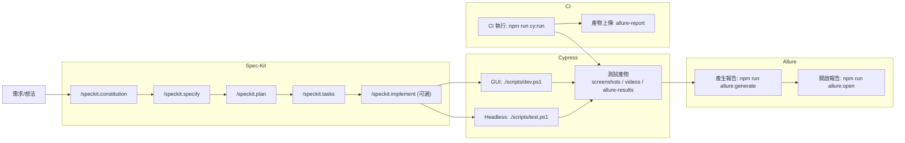

# cypress-pom-framework

一句話簡介：這個專案用來建立 Cypress 的 Page Object Model (POM) 測試框架。

## 特色
- POM 結構範例與可擴充的頁面物件
- 依 `tests/` 結構管理測試與頁面物件
- 支援以環境變數切換測試站點

## 需求
- 作業系統：Windows / macOS / Linux
- 語言/執行環境：Node.js 20+
- 套件管理：npm 9+
- 瀏覽器：Chrome 或 Edge（Cypress 可用內建瀏覽器，也可指定系統瀏覽器）
- 產生 Allure 報告：Java 11+（如 `allure` 指令執行失敗再安裝）
  - `allure` CLI 由 `allure-commandline` 提供（`npm install` 後可用 `npx allure` 或 `npm run allure:*`）

## 安裝

```powershell
# 安裝依賴
npm install
```

## 使用範例（從安裝到執行）
以下示範從零開始的基本流程：

```powershell
# 1) 安裝依賴
npm install

# 2) 建立環境設定檔（可選）
Copy-Item .env.example .env

# 3) (可選) Spec-Kit 檢查 + 開啟 Cypress GUI
./scripts/spec-kit-gui.ps1

# 4) 開啟 Cypress GUI
./scripts/dev.ps1

# 5) 直接執行全部測試
./scripts/test.ps1

# 6) 只跑單一 spec（範例）
npm run cy:run -- --spec tests/e2e/actions.cy.js

# 7) 產生與開啟 Allure 報告（可選）
npm run allure:generate
npm run allure:open
```

備註：
- 想切換測試站點，修改 `.env` 的 `CYPRESS_BASE_URL`。
- 若不需要 `.env`，會使用預設 `https://example.cypress.io`。

## 環境架設（整合版）
以下為目前專案「完整」環境需求與設定項目，請依使用情境準備：

### 必要環境（所有情境都需要）
1. 作業系統：Windows / macOS / Linux。
2. Node.js 20+（建議 LTS）。
3. npm 9+（隨 Node.js 一併安裝）。
4. 安裝專案依賴：`npm install`。
5. 設定站點：
   - 建立 `.env`，設定 `CYPRESS_BASE_URL` 指向測試站點。
   - 未設定時預設為 `https://example.cypress.io`。

### 測試執行環境（本機或測試機）
1. 瀏覽器：Chrome 或 Edge。
2. 執行測試：`./scripts/test.ps1` 或 `npm run cy:run`。

### Allure 報告環境
1. Java 11+（Allure 產報告需要）。
2. 報告指令：
   - 產生報告：`npm run allure:generate`
   - 開啟報告：`npm run allure:open`
   - 即時產生並開啟：`npm run allure:serve`
3. 產物路徑：
   - 結果：`tests/artifacts/allure-results/`
   - 報告：`tests/artifacts/allure-report/`

### Windows PowerShell 腳本權限（若遇到無法執行）
1. 以管理員身分開啟 PowerShell。
2. 執行：`Set-ExecutionPolicy RemoteSigned -Scope CurrentUser`。

### CI 環境（如 GitHub Actions）
1. Node.js 20+。
2. 安裝依賴：`npm install`。
3. 執行測試：`npm run cy:run`（或 `./scripts/test.ps1`）。
4. 需要報告時：
   - 安裝 Java 11+。
   - 執行 `npm run allure:generate`。
   - 上傳 `tests/artifacts/allure-report/` 作為產物。

## 使用方式

```powershell
# 本機啟動
./scripts/dev.ps1

# 執行測試
./scripts/test.ps1
```

## 快速開始
1. 先在專案根目錄執行 `npm install`。
2. 如需改測試站點，建立 `.env` 並設定 `CYPRESS_BASE_URL`。
3. 執行 `./scripts/dev.ps1` 開啟 Cypress GUI，或 `./scripts/test.ps1` 直接跑測試。

## 專案結構

```
src/        # 應用/原始碼
tests/      # 單元與整合測試
  e2e/      # Cypress spec
  pages/    # Page Objects
  support/  # Cypress support
  fixtures/ # Cypress fixtures
docs/       # 文件
assets/     # 靜態資源
scripts/    # 開發/建置腳本
specs/      # 規格/計畫/任務文件（Spec-Kit 最小化導入）
```

## Spec-Kit 最小化導入
本專案只採用 Spec-Kit 的「規格 / 計畫 / 任務」三份文件，不使用完整的 CLI 流程。

目前規格文件位置：
- `specs/001-cypress-pom-framework/spec.md`
- `specs/001-cypress-pom-framework/plan.md`
- `specs/001-cypress-pom-framework/tasks.md`

新增功能時的最低要求：
1. 建立新的編號資料夾，例如 `specs/002-<feature-name>/`。
2. 在資料夾內建立 `spec.md`、`plan.md`、`tasks.md`。
3. 任務完成後同步更新 `tasks.md` 狀態。

## Spec-Kit CLI（可選）
只有在你要使用 Spec-Kit 的完整 CLI 流程時才需要安裝。若只維持本專案的最小化導入，**不需要**安裝。

### 先備條件
- Python 3.11+
- [uv](https://docs.astral.sh/uv/)
- Git

### 安裝與檢查
```powershell
# 安裝 Specify CLI
uv tool install specify-cli --from git+https://github.com/github/spec-kit.git

# 檢查工具
specify check
```

### 初始化新專案（完整流程才需要）
```powershell
# 建立新專案（建議）
specify init <project-name> --ai codex --script ps

# 或在既有專案內初始化（可能覆蓋檔案，請慎用）
specify init --here --ai codex --script ps --force
```

### 導入後會新增的資料夾
- `.specify/`：Spec-Kit 模板與規格檔案。
- `.codex/`：AI agent 工作資料（已加入 `.gitignore`）。

CLI 產生的規格會放在 `.specify/specs/`，與本專案的 `specs/` 不衝突；若你要完全採用 CLI 流程，可只維護 `.specify/specs/`。

### Codex CLI 建議設定
若使用 Codex CLI，建議設定專案專屬資料夾：

```powershell
setx CODEX_HOME "<project-root>\\.codex"
```

### Spec-Kit 使用流程（本專案操作範例）
以下是本專案實際使用過的流程，可直接照做：

1. 確認 `specify` 可用：

```powershell
specify check
```

2. 建立專案憲章（測試品質、命名規範、POM、報告、CI）：

```
/speckit.constitution 制定本專案的測試品質、命名規範、POM 結構、報告與 CI 原則
```

3. 建立功能規格：

```
/speckit.specify 建立 Cypress POM 測試框架，包含頁面物件範例、測試範例、Allure 報告、CI 執行流程
```

4. 建立技術計畫：

```
/speckit.plan 使用 Cypress 13 + Allure，測試檔案放 tests/，以 PowerShell 腳本統一入口
```

5. 產生任務清單：

```
/speckit.tasks
```

### 整體流程圖（Spec-Kit → Cypress → Allure → CI）



### 一鍵流程（Spec-Kit 檢查 + Cypress GUI）
若想用單一指令完成 Spec-Kit 檢查並開啟 Cypress GUI，可使用：

```powershell
./scripts/spec-kit-gui.ps1
```

此腳本會先執行 `specify check` 與 `.specify` 檢查，再開啟 Cypress GUI。`/speckit.*` 指令仍需在對話中執行。

### 產出位置
- 憲章：`.specify/memory/constitution.md`
- 規格：`.specify/specs/001-cypress-pom-framework/spec.md`
- 計畫：`.specify/specs/001-cypress-pom-framework/plan.md`
- 任務：`.specify/specs/001-cypress-pom-framework/tasks.md`

### Spec-Kit 指令速查
**聊天指令（在 AI 對話中使用）**
- `/speckit.constitution`：建立/更新專案憲章
- `/speckit.specify`：建立功能規格
- `/speckit.plan`：建立技術計畫
- `/speckit.tasks`：產生任務清單
- `/speckit.implement`：依任務實作
- `/speckit.clarify`：釐清規格（可選）
- `/speckit.analyze`：一致性檢查（可選）
- `/speckit.checklist`：品質檢查清單（可選）

**CLI 指令（在終端機使用）**
- `specify init`：初始化 Spec-Kit 模板
- `specify check`：檢查工具安裝狀態

### 任務清單查看方式
```powershell
# 完整內容
Get-Content .specify/specs/001-cypress-pom-framework/tasks.md

# 只看已完成
rg "^\- \\[x\\]" .specify/specs/001-cypress-pom-framework/tasks.md

# 只看未完成
rg "^\- \\[ \\]" .specify/specs/001-cypress-pom-framework/tasks.md
```

## 設定
- 請使用 `.env.example` 作為範本建立 `.env`。
- `CYPRESS_BASE_URL`：測試站點 baseUrl，預設為 `https://example.cypress.io`。

## 撰寫 Page Object（POM）
建議在 `tests/pages/` 內以頁面或功能模組建立檔案，檔名採 `kebab-case`：

```javascript
// tests/pages/login-page.js
class LoginPage {
    emailInput() {
        return cy.get("[data-cy=email]");
    }

    passwordInput() {
        return cy.get("[data-cy=password]");
    }

    submitButton() {
        return cy.get("[data-cy=login-submit]");
    }

    login(email, password) {
        this.emailInput().type(email);
        this.passwordInput().type(password);
        this.submitButton().click();
    }
}

module.exports = LoginPage;
```

## 撰寫測試（Spec）
測試放在 `tests/e2e/`，檔名建議使用 `*.cy.js`：

```javascript
const LoginPage = require("../pages/login-page");

describe("Login", () => {
    const loginPage = new LoginPage();

    it("should login successfully", () => {
        cy.visit("/login");
        loginPage.login("user@example.com", "password");
        cy.contains("h1", "Dashboard").should("be.visible");
    });
});
```

## 自訂命令（Commands）
若有共用操作可放在 `tests/support/commands.js`：

```javascript
Cypress.Commands.add("loginByApi", (email, password) => {
    cy.request("POST", "/api/login", { email, password });
});
```

## 測試產物
- 截圖：`tests/artifacts/screenshots/`
- 錄影：`tests/artifacts/videos/`
- Allure 結果：`tests/artifacts/allure-results/`
- Allure 報告：`tests/artifacts/allure-report/`

## Allure 報告
1. 先執行測試產生結果檔：
   - `./scripts/test.ps1`
2. 產生報告：
   - `npm run allure:generate`
3. 開啟報告：
   - `npm run allure:open`

補充：
- 想快速產生並開啟報告，可用 `npm run allure:serve`。
- 結果輸出路徑可在 `cypress.config.js` 的 `resultsDir` 調整。

## Allure 整合 SOP
以下為整合 Allure 到 Cypress 的標準流程（新專案或維護時請遵循）：
1. 安裝依賴：
   - `npm install`
   - 確認 `package.json` 有 `allure-cypress` 與 `allure-commandline`。
2. 設定 Cypress 外掛：
   - 在 `cypress.config.js` 的 `setupNodeEvents` 內呼叫 `allureCypress(on, config, { resultsDir })`。
   - 結果路徑統一為 `tests/artifacts/allure-results/`。
3. 載入支援檔：
   - 在 `tests/support/e2e.js` 引入 `allure-cypress`。
4. 建立報告腳本：
   - 確認 `package.json` scripts 有：
     - `allure:generate`
     - `allure:open`
     - `allure:serve`
5. 產出與驗收：
   - 執行 `./scripts/test.ps1` 應產生 `tests/artifacts/allure-results/`。
   - 執行 `npm run allure:generate` 應產生 `tests/artifacts/allure-report/`。
6. 環境需求：
   - `allure` 指令若無法執行，請安裝 Java 11+ 後再重試。

## 常見問題
- 找不到 spec：確認檔案在 `tests/e2e/` 且符合 `*.cy.js` 命名。
- baseUrl 未生效：確認 `.env` 存在且 `CYPRESS_BASE_URL` 設定正確。
  - 或直接修改 `cypress.config.js` 的 `baseUrl`。

## 開發與測試
- 建議在 `AGENTS.md` 中維護團隊一致的貢獻規範與命令。
- 可列出常用指令，例如：
  - `./scripts/dev.ps1` — 本機執行應用
  - `./scripts/test.ps1` — 執行完整測試套件
  - `./scripts/build.ps1` — 產出發行產物

## 貢獻方式
- 請先閱讀 `AGENTS.md` 的貢獻規範。
- PR 請附上說明、測試結果與必要的截圖。

## 授權
（請填寫，例如 MIT / Apache-2.0 / Proprietary）

## 聯絡資訊
（請填寫，例如：維護者姓名、Email、Discord/Slack）
